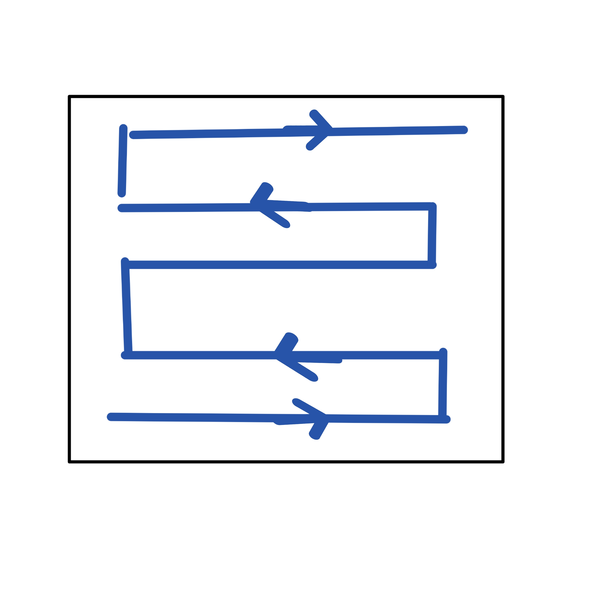
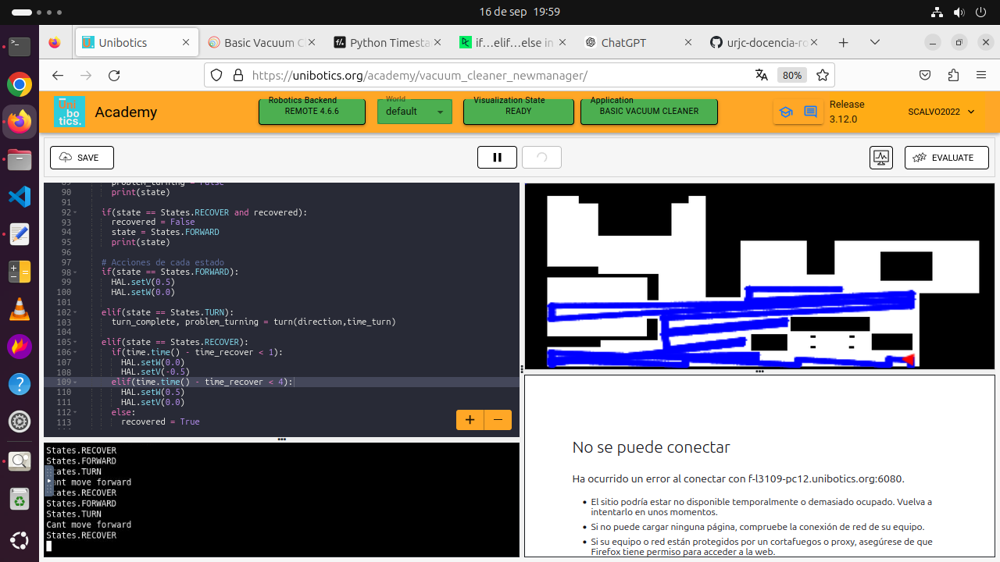
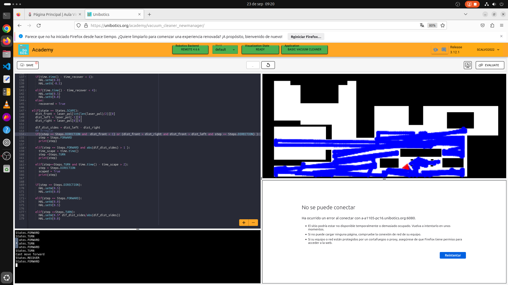
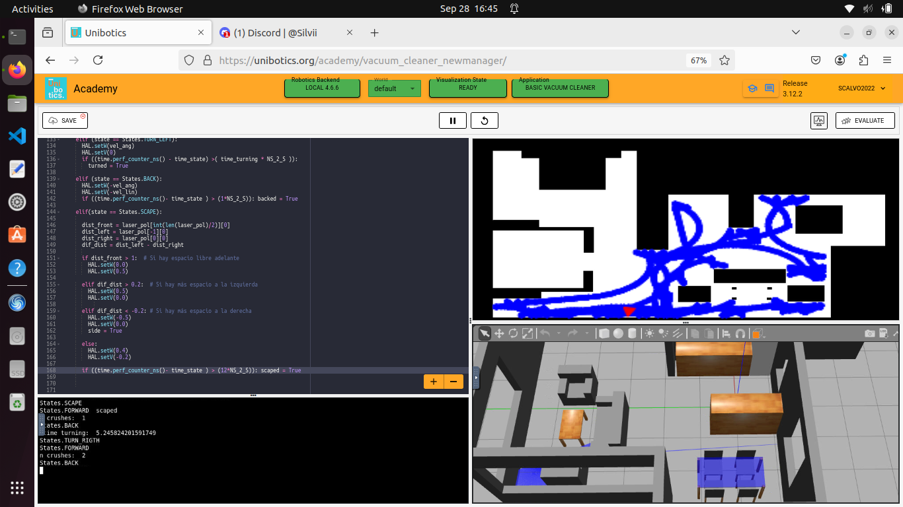
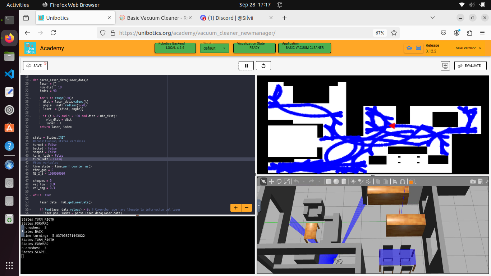
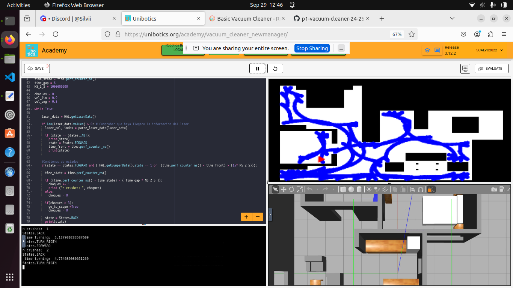

# ROOMBA - VACUUM CLEANER
### SILVIA CALVO CABELLO

# INTRODUCCION
La siguiente practica consiste en crear un programa para un robot aspiradora que solo consta de los siguientes sensores: Bumper, Laser (180º) y recorra la mayor cantidad de zonas de la casa como sea posible en el menor tiempo posible.

Para el control de la logica se usará una Maquina de Estados Finitos, estos estados variarán según la version del algoritmo implementado

# PRUEBAS
Para lograr el objetivo se crearon varios intentos de algortimos que pudiesen recorrer toda la casa, en los primeros le di mas importancia a dejar pocos huecos en blanco aunque recorrese menos zonas, luego se comentó en clase que el objetivo residia en llegar a más salas, por lo que cambié totalmente la manera de hacerlo.

A continuación, explico y muestro cada uno de los intentos y sus resultados, asi como sus problemas, siendo estos resueltos por el siguiente algortimo hasta llegar al final.

### ALGORITMO Nº1 SALA VACIA
Para crear el algoritmo de exploracion mi primer intento fue crear uno simple, que recoriese sin problemas una sala vacia mediante el siguiente patron: 
Avanzar hasta obstaculo, girar 90 grados, avanzar 2 segundos, girar 90 grados (cada vez girando hacia un lado distinto creando el siguiente)

**Problemas:** 

1. Como no sabemos la disposicion del robot no podemos calcular correctamente que gire 90 grados siempre. 
2. Solo funciona bien asegurado en salas vacias sin obstaculos

### ALGORITMO Nº2 ESTADO RECUPERACION
Para solucionar el problema de los obstaculos añadimos un estado que consista en que cuando se choque con alguno, de marcha atras y gire ciertos grados, para intentar alejarse de este. Permitiendo cubrir gran parte del mapa. 

**Problemas:** 
1. Cuando es un obstaculo funciona, pero no cuando es una esquina, ya que al girar y luego volver a avanzar se vuelve a dar, con la posibilidad de salir pero siendo poco óptimo.

### ALGORITMO Nº3 ESTADO SCAPE 
Para solucionar el problema de las esquinas añadimos un estado llamado SCAPE el cual intenta salir de las esquinas usando el laser para medir las distancias a las paredes a saber por donde hay huecos. 

**Problemas:** 
1. No llegaba a todas las salas

 
 
## RESULTADO FINAL 

 ### ALGORITMO Nº4 RANDOM
En el algoritmo anterior funcionaba muy eficientemete pero solo en unas determinadas condiciones, el robot deberia empezar siempre en la esquina superior derecha y estar alineado con la pared. Por ello, y por lo mencionado en clase por el profesor (que deberiamos randomizar el programa para que no se ajustase a un mapa en concreto), cambié el algoritmo al siguiente:

El robot avanzará con velocidad angular y linear, hasta chocarse, retrocederá y dependiendo del lado del choque girará en un sentido u en otro un tiempo random entre 4 y 5.5 segundos. Si se encuentra que se está chocando muy seguido, pasa al estado scape mencionado en el apartado anterior.

[PhotoGrafo](Grafo.jpg)

Como se puede comprobar, al tener varibles random, hay veces que el robot llega a todas las salas y hay otras que no.

 
 
 
## VIDEO DE MUESTRA

A partir del dia 26 de septiembre, la granja de ordenadores de la universidad dejó de funcionar (daba error de que no se podia conectar a ella y no dejaba entrar en vacuum cleaner y mas adelante dejaba entrar pero nunca se conectaba el docker) , por lo que las pruebas las realicé con mi ordenador, siendo su rendimiento mucho mas bajo. Por ello, se va a ver en el siguiente video (velocidad x4) que la pantalla de gazebo y la pantalla donde se ve las zonas por las que ha pasado van desfasadas. 

 [video](https://urjc-my.sharepoint.com/:v:/g/personal/s_calvo_2022_alumnos_urjc_es/EUKfurEL5gJOlo5tyHCTFbsBL5IvTUK8W0beVo4eNPNEfw?nav=eyJyZWZlcnJhbEluZm8iOnsicmVmZXJyYWxBcHAiOiJPbmVEcml2ZUZvckJ1c2luZXNzIiwicmVmZXJyYWxBcHBQbGF0Zm9ybSI6IldlYiIsInJlZmVycmFsTW9kZSI6InZpZXciLCJyZWZlcnJhbFZpZXciOiJNeUZpbGVzTGlua0NvcHkifX0&e=LFKA4W)

Estos son dos ejemplos, los cuales en menos de 15 minutos 

